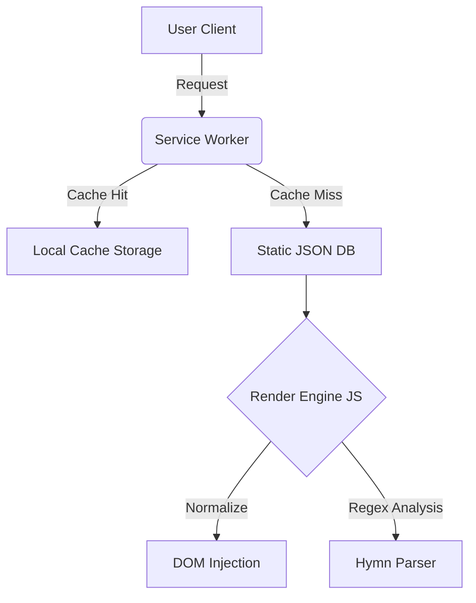

# 🏗 Arquitetura do Sistema

O sistema opera em uma arquitetura **Client-Side** pura, desacoplada de backends dinâmicos para maximizar a segurança, privacidade e performance.

## Fluxo de Dados



## Tech Stack

A escolha tecnológica priorizou a longevidade do código e a redução de dependências externas (`node_modules` zero para runtime).

### 🛠 Tech Stack & Decisões de Arquitetura

| Camada | Tecnologia | Motivação da Escolha |
| :--- | :--- | :--- |
| **Core** |  | Escolhido para eliminar o *overhead* de frameworks (React/Vue), garantindo um bundle inicial < 50KB e performance nativa em dispositivos low-end. |
| **Estilização** |  | Permite estilização *utility-first*, facilitando a manutenção e garantindo um CSS final minúsculo através do *purge* de classes não utilizadas. |
| **Dados** |  | Arquitetura *Serverless* real. Acesso aos dados com complexidade O(1) e zero latência de rede após o cache inicial. |
| **Engenharia** |  | Utilizado no pipeline ETL (Crawler) pela sua robustez em manipulação de strings e bibliotecas de parsing XML (`xml.etree`). |
| **Imagens** | **Canvas API** | Geração de imagens *client-side* para evitar custos de servidor e garantir privacidade total do usuário. |

## Estrutura de Diretórios

```Bash
/
├── index.html              # Entry point (SPA Shell)
├── app.js                  # Lógica Core (Router, Controller, Renderer)
├── bible-data.js           # Metadados estáticos (Índices)
├── crawler.py              # Script ETL (Data Engineering)
├── sw.js                   # Service Worker (PWA Offline Controller)
├── docs/                   # Documentação Técnica
│   ├── ARCHITECTURE.md
│   ├── DATA_ENGINEERING.md
│   └── GETTING_STARTED.md
└── *.json                  # Bancos de Dados Estáticos (Sharded by Version)
```